# PocketDesk

在手机上像发微信一样，指挥电脑里的 Claude Code、Codex、Pi 和 DSH 干活；顺手浏览电脑上的文件、看文档、互传文件。

电脑上跑一个常驻服务，手机装一个 App，扫码配对后就能用。数据只在你自己的手机、电脑和网络之间走，不经过第三方服务器。

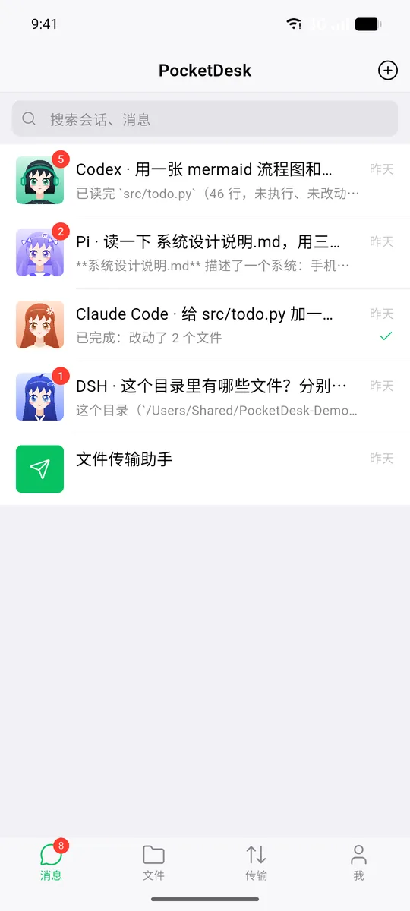 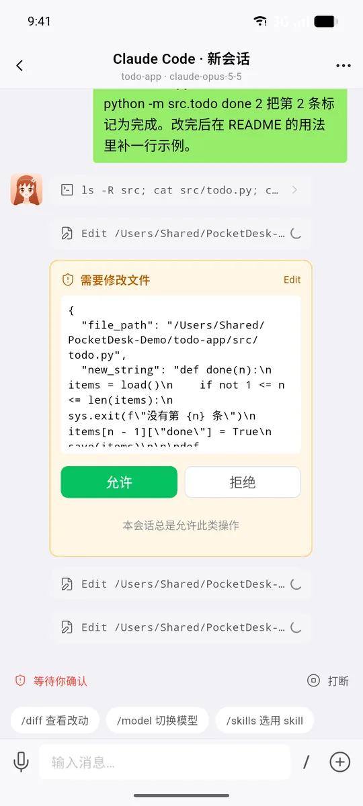 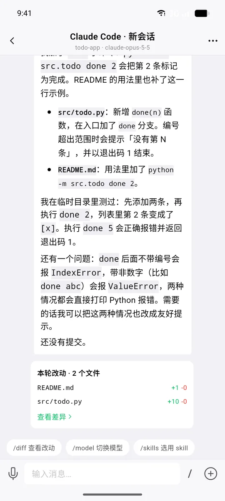


## 一、工作原理

### 1、整体流程

AI 编程工具一直在电脑上运行，读写的也是电脑上的文件；手机只负责发消息、看结果、点审批。

- **电脑端服务**：常驻在电脑上，按手机的请求启动 Claude Code、Codex、Pi、DSH，把它们的回复、工具调用和改动实时转给手机；也负责文件浏览和收发。
- **手机 App**：通过加密连接和电脑端服务通信。第一次扫码配对时记下电脑的证书指纹，之后每次连接都核对，对不上就拒绝。

一轮对话的过程：

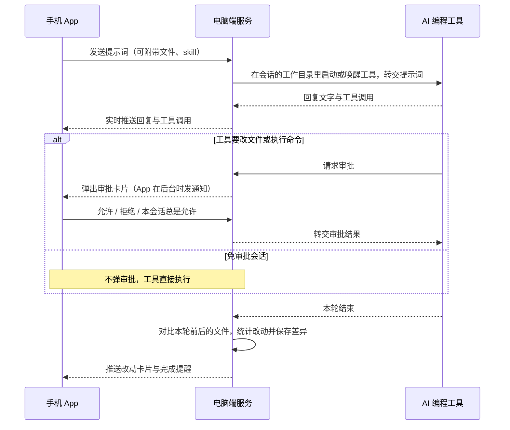
```mermaid
sequenceDiagram
    participant Phone as 手机 App
    participant Host as 电脑端服务
    participant Agent as AI 编程工具

    Phone->>Host: 发送提示词（可附带文件、skill）
    Host->>Agent: 在会话的工作目录里启动或唤醒工具，转交提示词
    Agent-->>Host: 回复文字与工具调用
    Host-->>Phone: 实时推送回复与工具调用

    alt 工具要改文件或执行命令
        Agent->>Host: 请求审批
        Host-->>Phone: 弹出审批卡片（App 在后台时发通知）
        Phone->>Host: 允许 / 拒绝 / 本会话总是允许
        Host-->>Agent: 转交审批结果
    else 免审批会话
        Note over Phone,Host: 不弹审批，工具直接执行
    end

    Agent-->>Host: 本轮结束
    Host->>Host: 对比本轮前后的文件，统计改动并保存差异
    Host-->>Phone: 推送改动卡片与完成提醒
```

### 2、远程连接

手机和电脑在同一个 Wi-Fi 下时直接走局域网。不在一个网络时（比如你在外面用流量，电脑在家），靠 [Tailscale](https://tailscale.com/) 连回电脑。

**原理**：Tailscale 把登录同一个账号的设备组成一个私有的虚拟局域网，每台设备分到一个固定的 `100.x.x.x` 地址。设备之间的数据用 WireGuard 加密，能直连就直连；直连不通时经 Tailscale 的中继服务器转发，中继只转发加密后的数据，看不到内容。PocketDesk 不需要公网 IP、不需要开路由器端口，也不需要自己的服务器。

**需要安装**：

| 设备 | 下载 |
| --- | --- |
| 安卓手机 | [tailscale-android](https://github.com/tailscale/tailscale-android)（也可以在谷歌应用商店搜 Tailscale） |
| Mac 电脑 | [Tailscale for Mac](https://tailscale.com/download/mac) |

两边装好后登录同一个账号，保持开启即可。App 的「我 → 异地连接」里能看到两边的状态，没装时也能从这里跳到下载页。

**连接过程**：

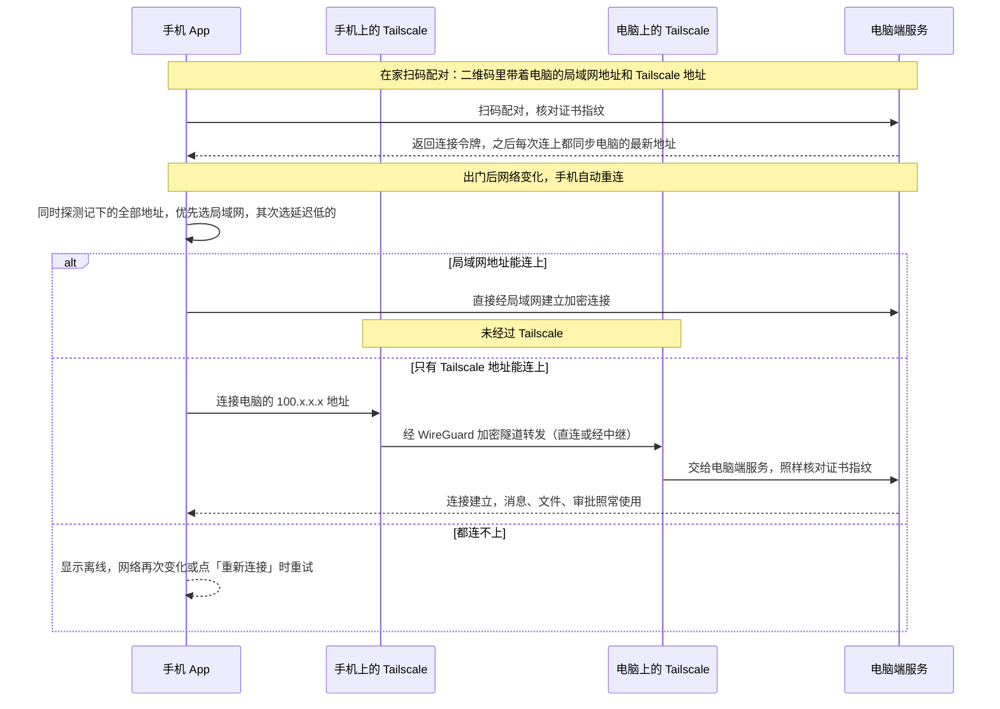
```mermaid
sequenceDiagram
    participant Phone as 手机 App
    participant TSP as 手机上的 Tailscale
    participant TSC as 电脑上的 Tailscale
    participant Host as 电脑端服务

    Note over Phone,Host: 在家扫码配对：二维码里带着电脑的局域网地址和 Tailscale 地址
    Phone->>Host: 扫码配对，核对证书指纹
    Host-->>Phone: 返回连接令牌，之后每次连上都同步电脑的最新地址

    Note over Phone,Host: 出门后网络变化，手机自动重连
    Phone->>Phone: 同时探测记下的全部地址，优先选局域网，其次选延迟低的

    alt 局域网地址能连上
        Phone->>Host: 直接经局域网建立加密连接
        Note over TSP,TSC: 未经过 Tailscale
    else 只有 Tailscale 地址能连上
        Phone->>TSP: 连接电脑的 100.x.x.x 地址
        TSP->>TSC: 经 WireGuard 加密隧道转发（直连或经中继）
        TSC->>Host: 交给电脑端服务，照样核对证书指纹
        Host-->>Phone: 连接建立，消息、文件、审批照常使用
    else 都连不上
        Phone-->>Phone: 显示离线，网络再次变化或点「重新连接」时重试
    end
```

### 3、和 Clash Verge TUN 模式同时使用时的注意点

如果电脑上用 Clash Verge 的 TUN 模式，让 AI 编程工具经住宅代理出去，**一定要关掉电脑上 Tailscale 的「Use Tailscale DNS settings」**。不关的话，DNS 查询和一部分流量会绕开 Clash，跑出住宅代理的范围，暴露你真实的网络位置。

**为什么会泄露**：

- 打开这个选项后，Tailscale 会把电脑的系统 DNS 改成它自己的解析地址 `100.100.100.100`。
- `100.x.x.x` 是 Tailscale 组网内部的地址，为了让 PocketDesk 能连回电脑，分流脚本把这段地址排除在 Clash 的 TUN 之外。结果所有 DNS 查询都直接交给了 Tailscale，Clash 完全看不到。
- Tailscale 再把不属于组网的域名转给你本地网络原来的 DNS（多半是运营商的）去解析。运营商能看到你在访问哪些 AI 服务；DNS 泄露检测网站也会显示你本地的 DNS 服务器，和住宅 IP 对不上。
- 程序拿到的是真实 IP，而不是 Clash 分配的虚拟地址，Clash 只能靠识别连接内容来猜域名。认不出来的连接会按 IP 规则走，可能落到基础节点甚至直连，而不是住宅出口。

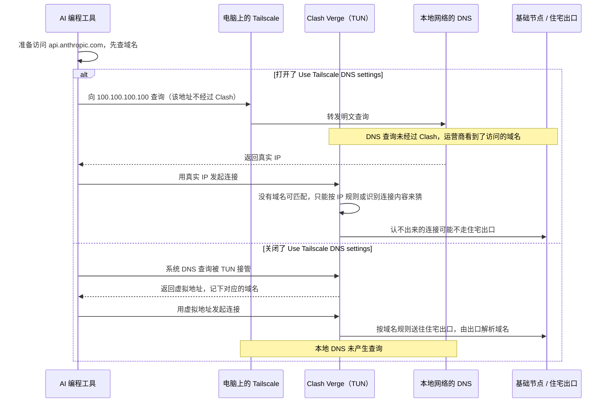
```mermaid
sequenceDiagram
    participant App as AI 编程工具
    participant TS as 电脑上的 Tailscale
    participant Clash as Clash Verge（TUN）
    participant ISP as 本地网络的 DNS
    participant Node as 基础节点 / 住宅出口

    App->>App: 准备访问 api.anthropic.com，先查域名

    alt 打开了 Use Tailscale DNS settings
        App->>TS: 向 100.100.100.100 查询（该地址不经过 Clash）
        TS->>ISP: 转发明文查询
        Note over Clash,Node: DNS 查询未经过 Clash，运营商看到了访问的域名
        ISP-->>App: 返回真实 IP
        App->>Clash: 用真实 IP 发起连接
        Clash->>Clash: 没有域名可匹配，只能按 IP 规则或识别连接内容来猜
        Clash->>Node: 认不出来的连接可能不走住宅出口
    else 关闭了 Use Tailscale DNS settings
        App->>Clash: 系统 DNS 查询被 TUN 接管
        Clash-->>App: 返回虚拟地址，记下对应的域名
        App->>Clash: 用虚拟地址发起连接
        Clash->>Node: 按域名规则送往住宅出口，由出口解析域名
        Note over TS,ISP: 本地 DNS 未产生查询
    end
```

**怎么关**：

| 位置 | 操作 |
| --- | --- |
| Mac 电脑 | 点菜单栏的 Tailscale 图标，在菜单里取消勾选「Use Tailscale DNS settings」；装了命令行工具的也可以执行 `tailscale set --accept-dns=false` |
| 安卓手机 | 手机上一般不同时跑 Clash，可以不改；如果手机也要经代理出去，在 Tailscale 设置里同样关掉「Use Tailscale DNS」 |

关掉后不影响 PocketDesk：手机连电脑用的是 `100.x.x.x` 地址，不依赖 Tailscale 的域名解析。分流脚本也单独把 `*.ts.net` 交给 Tailscale 解析，用 Tailscale 设备名访问照样可以。

**其他注意**：

- 用电脑端「异地连接」卡片提供一套「Clash 分流脚本」，它已经把 Tailscale 组网排除在 TUN 之外，并加了 DNS 与 IPv6 防泄露设置；Clash Verge 里的「DNS 覆写」保持关闭，否则会替换掉这些设置。
- 改完后打开 IP 和 DNS 泄露检测网站确认：出口 IP 是住宅 IP，DNS 服务器里没有你本地运营商的。


## 二、功能说明

### 1、一个 App 管多个 AI 编程工具

| 工具 | 能做什么 |
| --- | --- |
| Claude Code | 对话、逐条审批、切换模型和供应商、选用 skill、接着电脑上的会话聊 |
| Codex | 同上 |
| Pi | 对话、执行命令前在手机上审批、切换模型 |
| DSH（DeepSeek Harness） | 对话、切换模型 |

还能新建「免审批」会话：Claude Code 跳过全部确认，Codex 不审批也不进沙箱，适合放手让它跑。

### 2、手机查阅 AI 执行过程和结果

- **审批卡片**：AI 要改文件或执行命令时，手机上弹卡片，可以允许、拒绝或「本会话总是允许」。
- **本轮改动**：每轮结束列出改了哪些文件、各加减几行，点开看逐行差异。用命令或脚本生成的文件、工作区外的文件、Word / PPT / Excel 里的文字变化也算在内。
- **提醒**：需要审批和任务完成时弹通知，点通知直接进到那个会话并弹出审批。手机不在线时可以经 ntfy 或 Bark 推送，通知里不带代码和提示词。

### 3、模型和供应商随会话切换

- 每个会话可以单独换模型，列表里没有的也能手动填写。
- 电脑上用 [CC Switch](https://github.com/farion1231/cc-switch) 管理供应商时，Claude Code 和 Codex 会话可以单独换供应商（比如换成 DeepSeek 或中转站）。只读取 CC Switch 保存的配置，对这一个会话生效，不改电脑上的全局设置。CC Switch 改过数据目录，或用 `CLAUDE_CONFIG_DIR`、`CODEX_HOME` 换过 Claude Code、Codex 的目录时，会跟着找到。
- 可以查看、启用、停用 Claude Code 和 Codex 已装的 skill，勾选后随下一条消息使用。
- 电脑上没聊完的 Claude Code、Codex 会话，在手机上选一个就能接着聊；电脑那边又聊了几句，手机打开时会自动补上。

### 4、能直接访问电脑的文件系统

- **工作区**：把电脑上的文件夹封装为工作区，手机上浏览、搜索、上传、新建、编辑。
- **此电脑**：在电脑整个磁盘里找文件
- **手机**：把手机上的文件夹封装为工作区，电脑端也能管理它。

### 5、文档在手机上直接看

| 格式 | 怎么看 |
| --- | --- |
| Markdown | 手机上排版阅读，支持 Mermaid 图表、宽表格左右滑、公式 |
| PPT | 按原稿版式、字体和配色显示 |
| Word / Excel | App 内查看，保留标题、表格、图片和工作表 |
| PDF、图片 | App 内查看 |
| txt | 小说阅读器：分章分页、衬线排版、三种底色 |

聊天里的代码块和 Mermaid 图表也能画出来，可以全屏缩放、保存成图片。

### 6、连接方式

- **局域网**：手机和电脑在同一个 Wi-Fi 下，扫码配对后直接连。
- **Tailscale**：不在一个网络时，两边都装上 Tailscale 并登录同一个账号，手机先试局域网，连不上自动改走 Tailscale，原理见「一、工作原理 → 2、远程连接」。
- **手动地址**：也可以手动填写电脑的连接地址。

配对时核对电脑证书的指纹，之后每次连接都校验，防止被冒充。App 可以开启指纹或面容解锁。

### 7、传输文件

手机和电脑之间互传文本、图片和任意文件。大文件分段并行传，断网后接着传，App 重启后自动恢复未完成的任务。收到的文件按日期放进文件夹。

### 8、手机上的四个标签

| 标签 | 里面有什么 |
| --- | --- |
| 消息 | 会话列表，右上角加号新建会话 |
| 通讯录 | AI 好友（Claude Code、Codex、Pi、DSH）和预设助手 |
| 发现 | 文件、传输、剪切板、收藏夹、提示词、截取电脑屏幕 |
| 我 | 电脑与连接、工作空间、安全、外观、日志 |

### 9、通讯录里的预设助手

预设助手带着写好的系统提示词，可以交给任意一个 Agent 处理。内置翻译、OCR 识别、润色改写、总结提炼、代码审查、提示词优化六个，也可以自己新建。内置助手的提示词和参数也能修改，改过的显示「已修改」，随时可以恢复默认。

- **选 Agent**：开始对话前选交给谁处理，只列电脑上已安装的。对话中随时可以改参数，或换另一个 Agent 用同样的设置重新开一个会话，还能把刚才的输入带过去。
- **参数**：翻译有目标语言、翻译风格、是否保留格式、术语表；OCR 有识别语言、输出格式、是否保留排版、同时翻译成什么语言。参数会填进提示词里，每一轮对话电脑端都把这段提示词放在你的输入前面一起交给 Agent。
- **OCR 用法**：在对话里发图片或扫描件，Agent 会读取文件并只输出识别结果。

### 10、收藏夹、剪切板、提示词

三样东西存在电脑上，手机和电脑端看到的是同一份，一端改了另一端马上同步。

- **收藏夹**：聊天里长按一条消息选「收藏」，也可以手动写一条；支持搜索、置顶、重命名。
- **剪切板**：手机和电脑之间中转文字、图片和文件（单个不超过 25 MB），保留最近 200 条，置顶的不清理。电脑端可以直接粘贴图片或拖入文件。
- **提示词**：存常用提示词并分类；聊天时在「+」面板里点「提示词」就能放进输入框。

### 11、界面风格、头像和看图

- **八套风格**：微信、Codex、QQ、Claude、冰川玻璃、极光、新粗野、纸刊，各有浅色和深色；在「我 → 外观」（电脑端「设置 → 外观」）里切换，每套风格不只换颜色，圆角、头像形状、气泡、卡片、底栏都跟着变。
- **头像**：我自己和每个 AI 都能单独设置头像。内置 Claude、Codex、OpenAI、Gemini、DeepSeek、Pi 的官方标志（取自 [LobeHub Icons](https://github.com/lobehub/lobe-icons)，MIT 许可），也可以用相册里的图片。
- **看图**：关闭、分享、下载在右上角；双指捏合、双击、底部的放大缩小按钮都能缩放（10% 到 800%），放大后拖动平移，没放大时左右滑动切换同目录的图片。电脑端看图窗口同样支持滚轮、双击和按钮缩放。


## 三、效果展示

截图用的是演示数据，供应商名称和 IP 地址已脱敏。

### 1、新建会话

右上角加号和微信一样弹出菜单：新建各工具的会话、免审批会话、终端，接着电脑上的会话，或扫码配对。

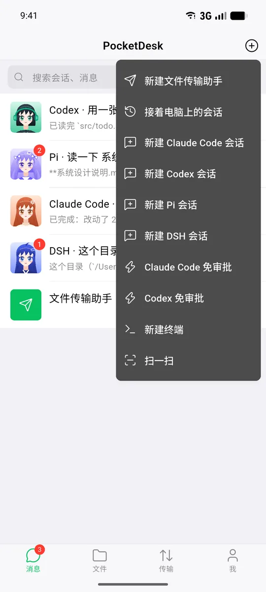

### 2、聊天和审批

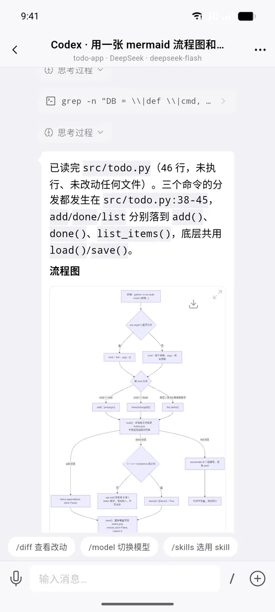 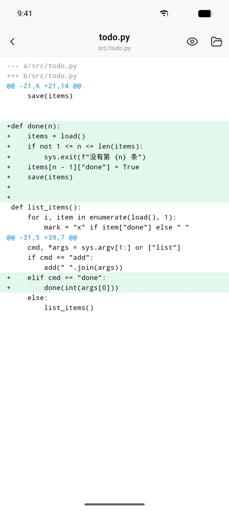 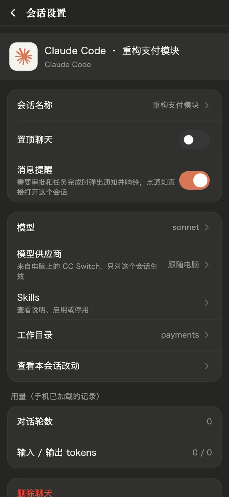

### 3、模型供应商

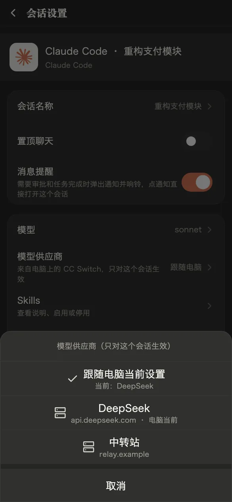

### 4、文件

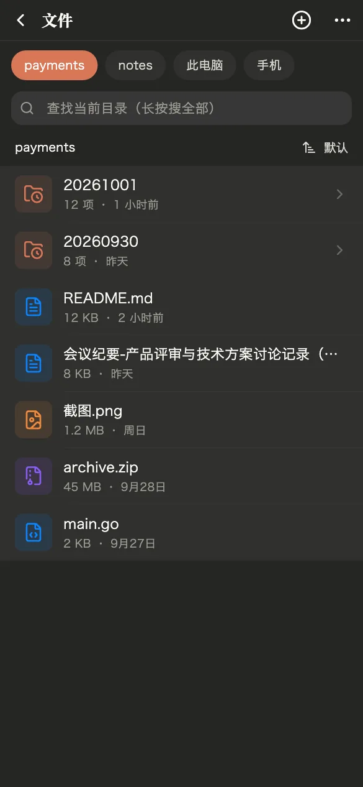 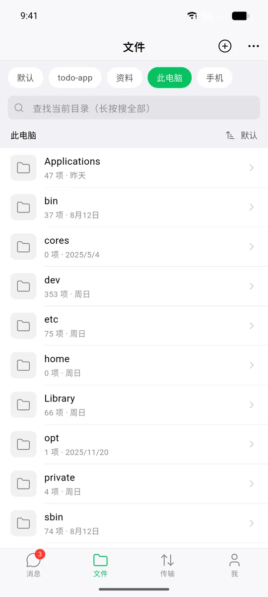 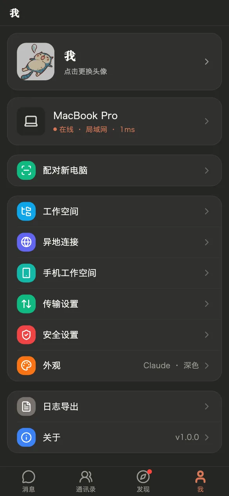

### 5、文档

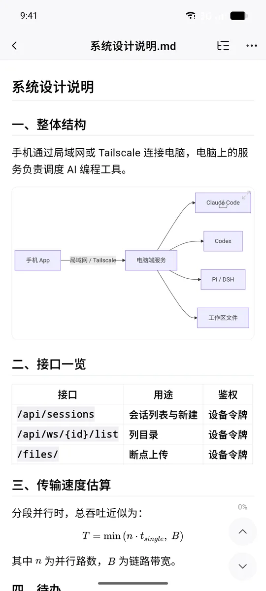 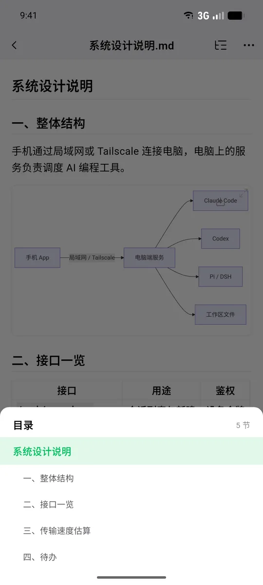 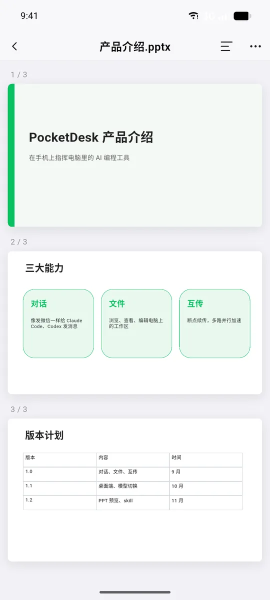 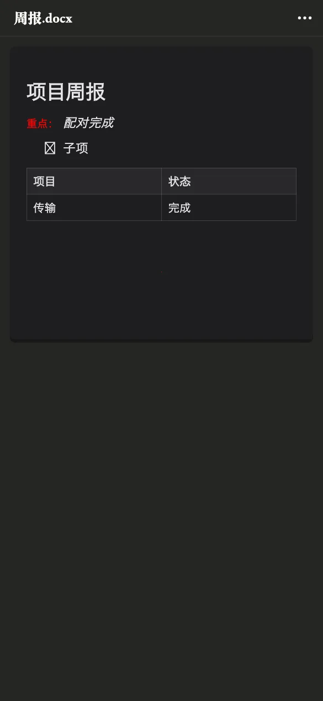

### 6、连接

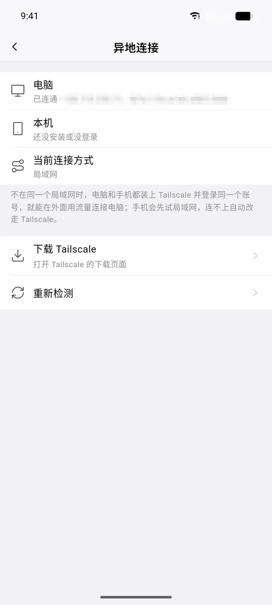

### 7、电脑端

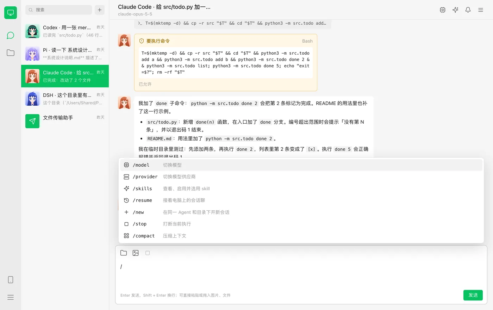

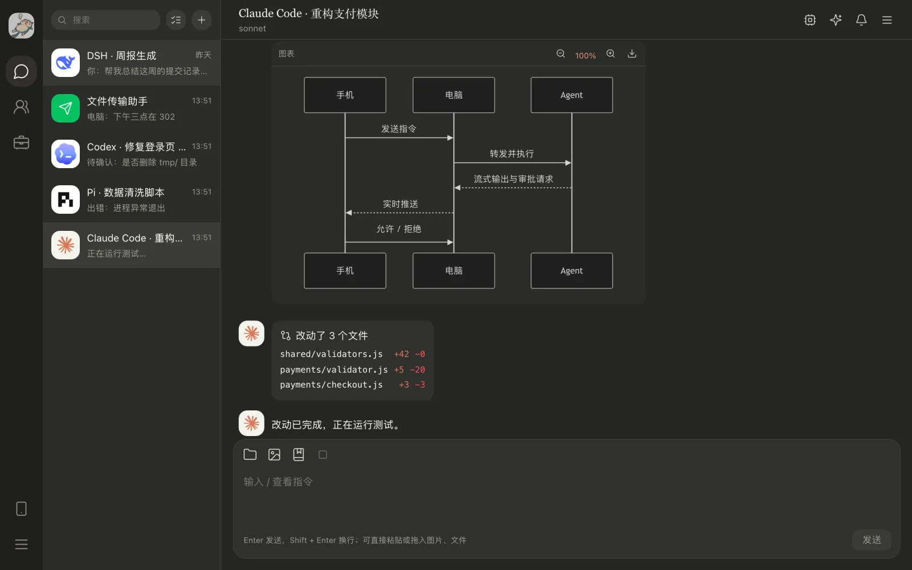


## 四、安装和使用

### 1、支持的平台

| 端 | 平台 |
| --- | --- |
| 手机 | Android 8.0 及以上 |
| 电脑 | macOS（Intel 和 Apple 芯片）；Windows 未进行适配 |

电脑上要先装好想用的 AI 编程工具（Claude Code、Codex、Pi、DSH 任选），PocketDesk 会自动找到它们。

### 2、从源码打包

需要 Go 和 Flutter。

```bash
# macOS 桌面应用，产物在 server/dist/，加 --install 直接装进「应用程序」
scripts/package-mac.sh

# 安卓安装包，按 CPU 架构拆分，产物在 app/build/app/outputs/flutter-apk/
scripts/build-apk.sh
```

### 3、配对和使用

1. 电脑上打开 PocketDesk，点「配对新手机」，屏幕上出现二维码。
2. 手机打开 App，扫码，回到电脑上点「允许」。
3. 在手机的消息页点右上角加号，新建 Claude Code、Codex、Pi 或 DSH 会话，选好工作目录就能开始聊。电脑端左侧列表的加号菜单和手机一样完整：文件传输助手、接着电脑上的会话、各个 Agent、免审批会话、终端（电脑端直接打开终端窗口）、预设助手、截取电脑屏幕、配对新手机；工作目录可以选已有工作区，也可以选电脑上任意文件夹。

想在外面用，就在电脑上装 [Tailscale for Mac](https://tailscale.com/download/mac)、手机上装 [tailscale-android](https://github.com/tailscale/tailscale-android)，登录同一个账号，详见「一、工作原理 → 2、远程连接」。

电脑端也可以用命令行：

```text
pocketdesk serve                 启动电脑端服务
pocketdesk app                   打开桌面应用窗口
pocketdesk pair                  在终端显示配对二维码
pocketdesk send <文件...>        把文件发给手机
pocketdesk install / uninstall   开机自动启动 / 取消
```


## 五、社区友链

[LINUX DO](https://linux.do/)：一个关注开发者、开源项目与 AI 工具交流的社区。感谢社区佬友对开源工具和 Agent 工作流的讨论与反馈。


## 六、许可

MIT 协议，见 [LICENSE](LICENSE)。
